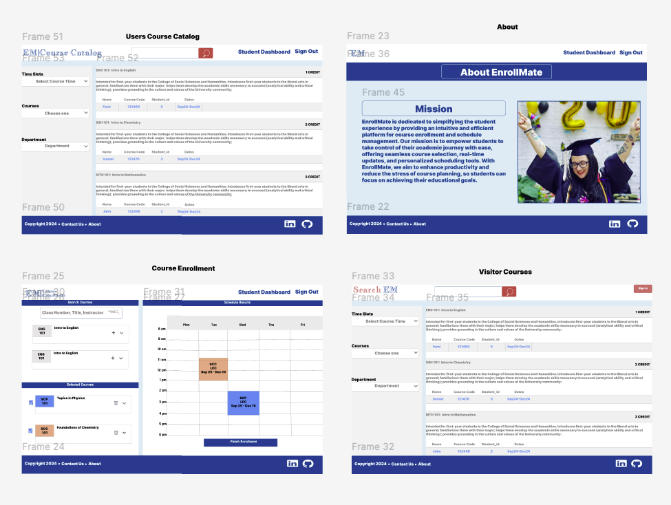
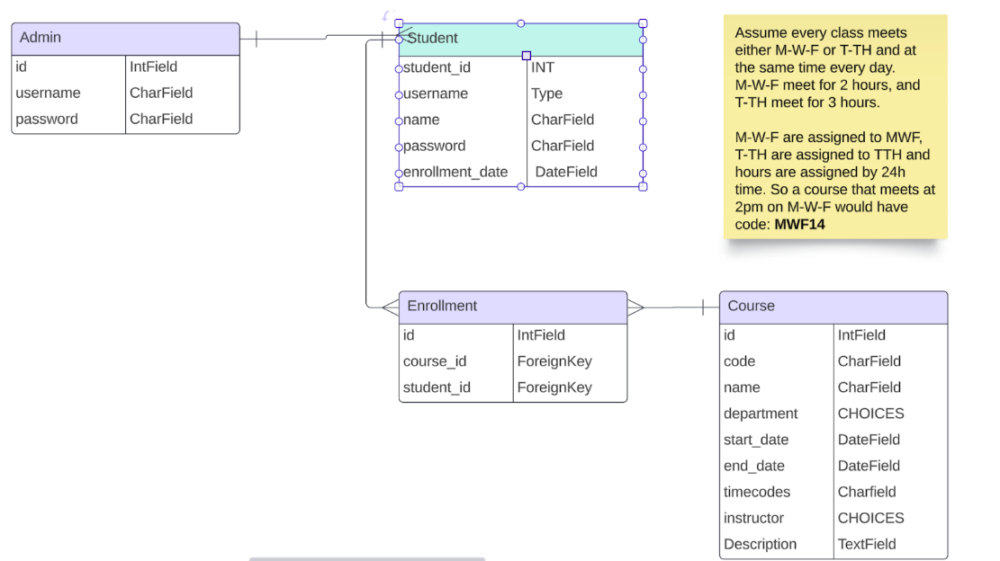
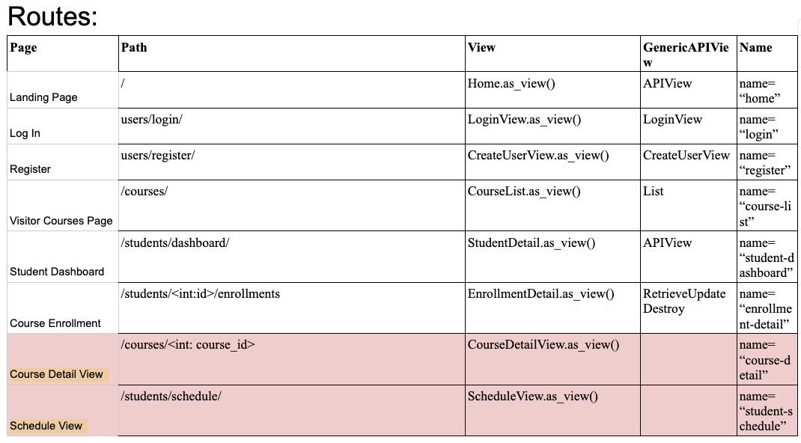

# **EnrollMate**

### EnrollMate is a user-friendly platform designed to streamline the student experience by simplifying course enrollment and schedule management. It provides a seamless interface for students to create enrollments select courses, and manage their schedules efficiently. By empowering students to take control of their academic planning with personalized scheduling tools, EnrollMate aims to boost productivity and minimize the stress of course planning, allowing students to focus on achieving their educational goals.

## Getting Started

- ### [Deployed Website](https://enroll-mate-front-end.vercel.app/)

## [Wire Frame](https://www.figma.com/design/UeBbmFAGVIVPOO7SxCCZtd/EnrollMate?node-id=0-1&node-type=canvas&t=uYbTRUTREkR04nx1-0)

## ERD

[ERD](https://lucid.app/lucidchart/3478ab7c-47fa-4576-8f98-0093d7ac4e7c/edit?invitationId=inv_ed7ff873-fc89-46df-8156-3e213bac9dbf&page=0_0#)

## Routes

## Technologies Used

### - [✔] Javascript
### - [✔] React
### - [✔] HTML
### - [✔] CSS
### - [✔] Python
### - [✔] Django

## Stretch Goals User Stories
* ### As an instructor, I can view a list of my courses on the courses page.
* ### As an admin, I can view a list of instructors on the instructors page.
* ### As a student, I want to be notified if I don’t meet the prerequisites for a course I attempt to enroll in
* ### As a student, I want to join a waitlist for a course if it's full, and be automatically enrolled when a spot opens up.

